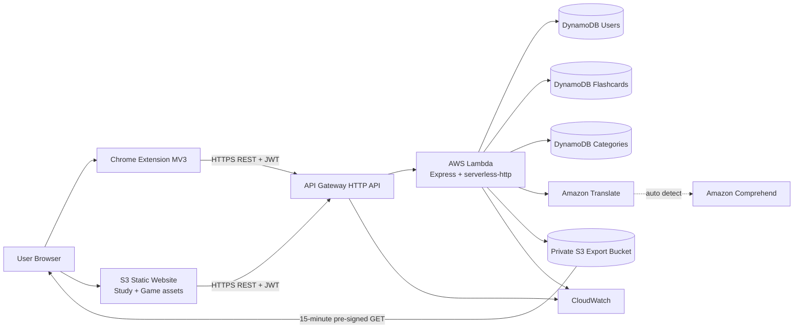

# 04. AWS Architecture và Decisions

## 1. Target architecture cho internship MVP



`Amazon Comprehend` là dependency gián tiếp khi `SourceLanguageCode=auto`. Có thể trình bày như supporting service; không cần viết client Comprehend trong app, nhưng Lambda role cần action `comprehend:DetectDominantLanguage`.

## 2. Vì sao chọn serverless

- Không quản lý server/OS, phù hợp demo nhỏ.
- Express hiện tại được tái sử dụng qua `serverless-http`.
- Scale-to-zero/usage-based cho Lambda/API Gateway.
- DynamoDB khớp access pattern user-owned data.
- S3 phù hợp static web và private exports.
- Mỗi dịch vụ có trách nhiệm dễ giải thích trong báo cáo thực tập.

Trade-off:

- Cold start và timeout.
- DynamoDB cần thiết kế theo access pattern, không như JSON/database relational.
- WebSocket realtime cần kiến trúc riêng, không thể giữ in-memory local server.
- Cấu hình CORS/origin và nhiều endpoint dễ sai nếu làm thủ công.

## 3. Trách nhiệm từng component

### API Gateway HTTP API

- Endpoint public HTTPS duy nhất cho REST API.
- Proxy request vào Lambda.
- Xử lý preflight và thêm CORS headers khi cấu hình CORS.
- Không đảm nhiệm app auth hiện tại; JWT được verify trong Express.

AWS lưu ý rằng khi HTTP API CORS được bật, API Gateway xử lý preflight và bỏ qua CORS headers từ backend integration. Express vẫn có allowlist và có thể trả 403, nên hai danh sách phải đồng nhất. Source: [Configure CORS for HTTP APIs](https://docs.aws.amazon.com/apigateway/latest/developerguide/http-api-cors.html).

### Lambda

- Chạy routes, validation, auth, orchestration.
- Không lưu durable state trong `/tmp`, global Map hoặc timer.
- Nhận AWS credentials tự động từ execution role.
- Nhận `AWS_REGION` tự động từ Lambda runtime; không set reserved key này trong function configuration.
- Runtime target: **Node.js 24.x** sau compatibility test; không tiếp tục Node.js 20 cho deploy mới. Chọn 24 thay vì 22 vì `nodejs22.x` hết hỗ trợ 2027-04-30 (lặp lại vấn đề sau chưa đầy một năm), còn `nodejs24.x` tới 2028-04-30 và khớp Node v24 đang chạy ở máy dev.

### DynamoDB

- Users: lookup theo username cho login/JWT validation.
- Flashcards: query partition của current user.
- Categories: query partition của current user.
- Provisioned `1 RCU/1 WCU` phù hợp demo traffic thấp; monitor throttling. Theo AWS, 1 RCU phục vụ một strongly consistent read/s cho item tới 4 KB (hoặc hai eventually consistent reads), 1 WCU phục vụ một write/s cho item tới 1 KB. Source: [DynamoDB provisioned capacity](https://docs.aws.amazon.com/amazondynamodb/latest/developerguide/provisioned-capacity-mode.html).

### S3 public static site bucket

- Chỉ chứa HTML/CSS/JS/config public.
- Đề xuất một bucket với prefixes `study/` và `game/` để relative links `/study/`, `/game/` hoạt động.
- Không chứa secret, `.env`, source map nhạy cảm hay export.
- Website endpoint HTTP-only; demo-only. Production dùng CloudFront/Amplify HTTPS.

### S3 private export bucket

- Block Public Access bật toàn bộ.
- Object key `${userId}/flashcards-${username}-${timestamp}.json`.
- Lambda role có `PutObject`/`GetObject` trên bucket objects.
- Browser nhận URL ký tạm thời, mặc định code hiện tại 900 giây.
- Pre-signed URL cho phép truy cập giới hạn thời gian mà không cấp AWS credentials cho user. Source: [S3 pre-signed URLs](https://docs.aws.amazon.com/AmazonS3/latest/userguide/using-presigned-url.html).

### Amazon Translate

- Translate text sang tiếng Việt mặc định.
- Không suy luận wordform đáng tin cậy; response trả `wordform: unknown`.
- Input limit app mặc định 120 ký tự để kiểm soát chi phí.
- `auto` detection có thể phát sinh usage/cost Amazon Comprehend.

### CloudWatch

- Lambda logs, errors, duration, throttles.
- API Gateway request/error metrics.
- Alarm và evidence cho demo.
- Log retention phải đặt hữu hạn.

## 4. Network và trust boundaries

```text
Untrusted client:
  extension, browser JS, localStorage, chrome.storage, all request payloads

Public boundary:
  S3 website endpoint, API Gateway endpoint, pre-signed export URL

Trusted AWS execution:
  Lambda role, DynamoDB tables, Translate/Comprehend calls, private export bucket
```

Không tin `userId`, role, score hoặc ownership từ client. Backend lấy user từ JWT đã verify. Pre-signed URL là bearer capability: ai có URL trong thời gian còn hạn đều tải được, nên không log/chia sẻ URL.

## 5. Static site layout target

```text
s3://<site-bucket>/
├── study/
│   ├── index.html
│   ├── app.js
│   ├── styles.css
│   └── config.js
└── game/
    ├── index.html
    ├── app.js
    ├── styles.css
    └── config.js
```

URLs:

```text
http://<site-bucket>.s3-website-<region>.amazonaws.com/study/
http://<site-bucket>.s3-website-<region>.amazonaws.com/game/
```

Config target:

- Study: `API_BASE_URL=<API Gateway>`, `GAME_URL=/game/`.
- Game: `API_BASE_URL=<API Gateway>`, `STUDY_URL=/study/`. Realtime UI phải được **tắt trong code** (ẩn tab hoặc guard WebSocket). Chỉ đặt `REALTIME_URL=""` là **không đủ**: `game/app.js:3` fallback về `ws://<origin hiện tại>/realtime` khi giá trị falsy, dẫn tới WebSocket lỗi trên S3. Xem AUD-P0-08.
- Extension: `API_BASE_URL=<API Gateway>`, `STUDY_URL=<site>/study/`.

### Ranh giới CORS của extension

Hai thành phần extension gọi API từ **hai origin khác nhau**, và điều này quyết định thiết kế allowlist:

| Thành phần | Origin gửi lên API | Trong allowlist? |
|---|---|---|
| `popup.js` (login, sync, export, translate) | `chrome-extension://<id>` | Có |
| `contentScript.js` (translate trong editor) | Origin của trang web user đang đọc | **Không** |

Content script gửi request thay mặt trang web nó được inject vào, nên tuân theo CORS của trang đó (Chrome 85+; host permissions không miễn trừ). Không thể đưa "mọi website" vào allowlist, nên trên AWS luồng translate phải đi qua background service worker (origin `chrome-extension://<id>`) thay vì fetch trực tiếp từ content script. Đây là code change bắt buộc - xem AUD-P0-07.

## 6. Architecture decisions

### ADR-01 - Giữ Express, không rewrite Lambda-native routes

Reason: code đã tách `app.js/server.js/lambda.js`; rewrite tăng regression không cần thiết.

### ADR-02 - Ba DynamoDB tables theo requirement hiện tại

Reason: ownership/access pattern rõ, đơn giản cho report. Single-table design không cần cho scope sinh viên này.

### ADR-03 - JWT custom cho MVP, Cognito là future hardening

Reason: giữ UX/code hiện tại. Điều kiện: secret mạnh, protected routes, demo data, ghi rõ limitation về revocation/rotation.

### ADR-04 - Một site bucket, một export bucket

Reason: public/private boundary rõ. Không bao giờ bật public access cho export bucket.

### ADR-05 - Manual Console là primary learning path

Reason: người học cần hiểu từng service. SAM là optional automation sau khi template được sửa và validate.

### ADR-06 - Realtime multiplayer ngoài MVP

Reason: local WebSocket design không phù hợp Lambda. Game solo có thể demo mà không thêm WebSocket API/tables/race-condition scope.

### ADR-07 - S3 website chỉ cho demo

Reason: đáp ứng mục tiêu đơn giản/chi phí thấp nhưng endpoint không HTTPS. Production path là CloudFront/Amplify.

### ADR-08 - Translate phải đi qua background service worker trên AWS

Status: **cần quyết định của owner trước khi deploy.**

Context: `contentScript.js` hiện fetch `/api/translate` trực tiếp. Trên AWS với exact-origin allowlist, request này mang origin của trang web và bị 403. Local không lộ lỗi vì `allowAllOrigins` bật mặc định.

Decision cần chọn:

1. Định tuyến translate qua `background.js` (khuyến nghị) - giữ nguyên UX, origin trở thành `chrome-extension://<id>`, allowlist vẫn exact.
2. Chỉ demo translate từ popup, ghi editor-translate là local-only.

Rejected: nới CORS thành `*` hoặc `CORS_ALLOW_ALL=true` trên AWS. Việc này biến `/api/translate` thành endpoint mở cho mọi trang web gọi được, vi phạm SR-05 và tạo rủi ro chi phí Translate/Comprehend.

## 7. Failure modes và behavior mong đợi

| Failure | Expected behavior |
|---|---|
| DynamoDB throttling | API 5xx hiện tại; log CloudWatch; client retry có kiểm soát sau cải thiện |
| Invalid/expired JWT | 401, frontend logout/re-auth |
| Disallowed origin | API Gateway/Express chặn; không đổi thành `*` để chữa nhanh |
| Translate AccessDenied | Log permission failure; kiểm tra Comprehend + Translate IAM |
| Translate low-confidence auto detect | Trả error hiện tại; future UX cho nhập source language |
| Export bucket missing | 500 `EXPORT_BUCKET is required...`; deploy gate phải phát hiện |
| Pre-signed URL expired | User export lại; không mở public bucket |
| Lambda timeout during sync | Có thể partial upsert; retry và đối chiếu count |
| Site config cũ | Browser gọi localhost/wrong API; version/evidence config trước upload |
| Content script translate trên AWS | 403 CORS. Không nới allowlist; định tuyến qua service worker (ADR-08) |
| Game mở tab Realtime trên S3 | WebSocket fail + console error. Phải tắt UI trong code, không chỉ để `REALTIME_URL=""` |

## 8. Future architecture cho realtime (không implement trong task này)

```text
Game Web -> API Gateway WebSocket API
  $connect/$disconnect/actions -> Lambda handlers
  -> DynamoDB Connections + Rooms (TTL)
  -> execute-api:ManageConnections to push events
```

Không tái sử dụng `Map`/`setInterval` làm durable room store. Countdown/expiration cần timestamp/state machine; có thể thêm EventBridge sau khi core flow ổn định.

# Cập nhật 2026-07-21 - Gỡ Amazon Translate

Amazon Translate và Amazon Comprehend đã ra khỏi kiến trúc.

Sơ đồ mục 1 rút gọn còn:

```text
Lambda -> DynamoDB (Users/Flashcards/Categories)
Lambda -> Private S3 Export Bucket -> pre-signed GET 15 phút
Lambda/API Gateway -> CloudWatch
```

Không còn node `TRANS[Amazon Translate]` và `COMP[Amazon Comprehend]`, nên phần
giải thích "Comprehend là dependency gián tiếp khi `SourceLanguageCode=auto`"
không còn áp dụng.

Mục 4 (Amazon Translate) bị bỏ. Mục 5 (CORS): bảng chỉ còn dòng `popup.js` với
origin `chrome-extension://<id>`. `contentScript.js` không còn gửi request nào
tới API, nên không còn dòng "**Không**" trong allowlist.

## ADR-08 - Đóng bằng cách gỡ tính năng

Status: **RESOLVED (2026-07-21) - superseded.**

ADR-08 trước đây yêu cầu owner chọn giữa (1) định tuyến translate qua background
service worker, hoặc (2) chỉ demo translate từ popup. Owner chọn phương án thứ
ba xuất hiện sau khi deploy: **gỡ hẳn Translate**, vì account không có dịch vụ.

Hệ quả: quyết định chặn deploy của ADR-08 không còn. Phương án "nới CORS thành
`*`" vẫn bị từ chối như cũ, và giờ không còn động cơ nào để nới.

Bảng failure modes mục 7: bỏ 4 dòng liên quan Translate (`Translate
AccessDenied`, `Translate low-confidence auto detect`, `Content script translate
trên AWS`). Các dòng còn lại giữ nguyên.
