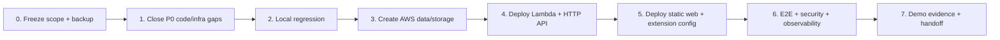

# 06. Migration Plan và Delivery Gates

## 1. Nguyên tắc

- Không rewrite project.
- Giữ route names và UX hiện tại.
- Mỗi phase phải chạy local regression trước AWS.
- Không trộn realtime migration vào core AWS MVP.
- Không đưa credentials/secrets vào repo.
- Chỉ tuyên bố phase complete khi có evidence.

## 2. Phases tổng thể



## 3. Phase 0 - Freeze scope và baseline

Tasks:

1. Xác nhận AWS MVP không gồm realtime multiplayer.
2. Chọn region và resource prefix, ví dụ `flashcard-demo`.
3. Ghi Git commit/branch và bảo toàn dirty worktree.
4. Xác nhận root project là source of truth.
5. Tạo account budget/billing alert trước khi bật paid usage.
6. Lưu baseline local screenshots/test output.

Gate G0:

- Scope ký nhận.
- Không có secret trong `git status`/tracked files.
- Có rollback owner và demo date.

## 4. Phase 1 - Close P0 gaps (task implementation tương lai)

Không thực hiện trong task tài liệu này. Required backlog:

1. Đổi SAM/runtime docs từ Node.js 20 sang **Node.js 24.x** (không phải 22.x - xem AWS-001) và test compatibility.
2. Thêm `comprehend:DetectDominantLanguage` hoặc đổi translate source thành explicit `en`.
3. Xóa reserved `AWS_REGION` khỏi SAM/Lambda configured variables; dùng runtime-provided value.
4. Tạo strategy environment config không phụ thuộc sửa tay nhầm file.
5. Set `SERVE_STUDY_STATIC=false` trên AWS.
6. Bỏ sample password prefill và nâng password policy nếu publish/demo public.
7. Loại nested zip/build artifact khỏi SAM CodeUri/package.
8. **Tắt realtime UI thật sự trong code** (AWS-008). Đặt `REALTIME_URL=""` là chưa đủ - giá trị falsy rơi vào fallback `ws://<origin>/realtime`.
9. **Định tuyến translate qua background service worker** (AWS-007). Đây là P0 code change; nếu owner quyết định không làm, phải chính thức hạ FR-04b xuống `OUT` trước khi deploy.

Mục 8 và 9 là hai thay đổi **code**, khác với 1-7 vốn chỉ là config/scope. Bỏ qua chúng thì demo AWS sẽ có nút Translate hỏng trong editor và console lỗi WebSocket ở Game.

Gate G1:

- `npm run check` pass.
- Toàn bộ changed JS được syntax check.
- SAM template validate/lint pass bằng SAM CLI.
- `npm audit --omit=dev` không có high/critical.
- P0 checklist đóng.

## 5. Phase 2 - Local regression

Local config:

```text
DATA_STORE=local
API_BASE_URL=http://localhost:3000
```

Test:

- Register/login sample và user mới.
- Extension highlight -> translate mock -> save local.
- Sync local JSON.
- Study CRUD/category flows.
- Solo game/scoring.
- Export relative URL.
- Local realtime chỉ để bảo vệ regression, không tính AWS acceptance.

Gate G2: tất cả core MUST pass; known failures ghi issue/backlog, không sửa adhoc ngay trước deploy.

## 6. Phase 3 - AWS data/storage foundation

Create:

- DynamoDB Users, Flashcards, Categories.
- Private S3 export bucket.
- Public S3 site bucket cho demo.
- Lambda execution role least privilege.
- CloudWatch log retention/alarm placeholders.

Data migration choice:

- Không copy sample users/password từ local JSON.
- Register cloud demo users mới.
- Dùng extension `/api/sync` để upload demo cards sau login cloud.
- Nếu cần bulk migration lớn, viết one-off script riêng với dry-run; không dùng Scan và không commit data thật.

Gate G3:

- Table keys/region/name match environment variables.
- Export bucket raw public access bị block.
- Site bucket chỉ chứa frontend assets.
- IAM policy reviewed.

## 7. Phase 4 - Backend deploy

Steps high-level:

1. Build production artifact clean.
2. Create/update Lambda Node.js 24.x.
3. Set env vars and execution role.
4. Create HTTP API proxy integration and CORS.
5. Test `/api/health`.
6. Test register/login/Dynamo persistence.
7. Test Translate + Comprehend permission.
8. Test export private/presigned behavior.

Gate G4:

- API health 200.
- Protected API negative tests pass.
- No Lambda import error.
- Translate provider is `amazon-translate`.
- CloudWatch log shows no AccessDenied.

## 8. Phase 5 - Static web và extension

Deploy one site bucket layout:

```text
/study/*
/game/*
```

Update deployment config with actual API URL. Update extension config and exact extension ID in CORS. Reload unpacked extension after config change.

Gate G5:

- Study page Network tab không gọi localhost.
- Study/Game navigation works.
- Extension login/translate/sync/export works.
- CORS works for site origin and extension origin, rejects an unlisted origin.

## 9. Phase 6 - E2E, security, operations

Run [09_TEST_AND_ACCEPTANCE.md](09_TEST_AND_ACCEPTANCE.md).

Additionally:

- Set CloudWatch log retention.
- Create alarms.
- Set S3 export lifecycle.
- Verify budget.
- Inspect logs for tokens/password/pre-signed URLs.
- Run cross-user isolation test.
- Test sync at agreed maximum demo size.

Gate G6: all MUST acceptance pass; evidence stored without secrets.

## 10. Phase 7 - Demo/handoff

Artifacts:

- Architecture diagram.
- Resource inventory with service purpose.
- Screenshots: API health, DynamoDB item, S3 website, private export denial + signed success, Translate result, CloudWatch log/metric.
- Cost-control summary.
- Known limitations: HTTP static website, custom JWT, no realtime AWS, sync upsert-only.
- Rollback procedure.
- `LOG.md` entry with commit and test results.

## 11. Data cutover strategy

### Recommended demo cutover

1. Keep local cards in `chrome.storage.local`.
2. Point extension to cloud API.
3. Register new demo account.
4. Login then click Sync once.
5. Verify count on Study Web and DynamoDB.
6. Do not clear local until verification/export completed.

### Rollback

- Revert extension config to localhost.
- Restore previous Lambda code version/alias or upload previous known-good zip.
- Restore previous Lambda environment configuration.
- Restore previous site asset version (S3 versioning recommended if enabled).
- Do not delete DynamoDB tables during incident; preserve for diagnosis unless data/security requires otherwise.

## 12. Change sequencing to reduce risk

Safe order:

```text
runtime/IAM/template -> tests -> DynamoDB/S3 -> Lambda -> API Gateway
-> site config/upload -> extension config/reload -> E2E
```

Avoid:

- Pointing extension to AWS before CORS/auth smoke pass.
- Making export bucket public to fix a download issue.
- Setting CORS `*` to bypass origin mismatch - kể cả khi triệu chứng là "Translate trong editor bị 403". Nguyên nhân đúng là AUD-P0-07, không phải allowlist thiếu origin.
- Deploying duplicate project folder or stale zip.
- Enabling realtime UI without a deployed WebSocket endpoint.
- Coi `REALTIME_URL=""` là đã tắt realtime.

## 13. Estimate by work package (không phải deadline)

| Package | Complexity | Main uncertainty |
|---|---|---|
| P0 runtime/IAM/config | Small | Node 24 compatibility, config discipline |
| P0 translate qua service worker (AWS-007) | Small-Medium | message passing, giữ nguyên UX editor |
| P0 tắt realtime UI (AWS-008) | Small | chọn ẩn UI hay guard WebSocket |
| Manual core AWS setup | Medium | IAM/CORS/resource naming |
| Static web/extension cutover | Small-Medium | exact origins and extension ID |
| E2E/hardening | Medium | sync size, Translate auto detect |
| Realtime AWS | Large | explicitly separate future project |
